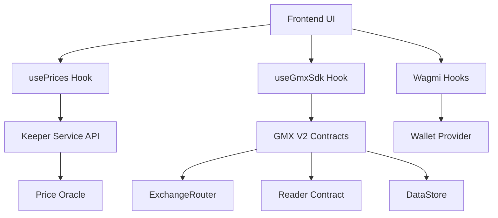

# GMX V2 UI Integration Guide
> Step-by-step guide to transform a Mock UI into a Functional Trading Interface

## 📋 Overview

This document provides a comprehensive guide to integrate a mock GMX-style UI with actual GMX V2 smart contracts, enabling real trading functionality including wallet connection, price feeds, order management, position tracking, and liquidity operations.

## 🏗️ System Architecture



## 🔧 Environment Configuration

### Frontend `.env.local`

Create a `.env.local` file in your frontend directory:

```bash
# Chain Configuration
NEXT_PUBLIC_CHAIN_ID=22469
NEXT_PUBLIC_CHAIN_NAME="Your Chain Name"
NEXT_PUBLIC_RPC_URL=http://your-rpc-url:8545

# Keeper Service
NEXT_PUBLIC_KEEPER_API_URL=http://127.0.0.1:9090

# WalletConnect
NEXT_PUBLIC_WALLET_CONNECT_PROJECT_ID=your_project_id_here

# Contract Addresses
NEXT_PUBLIC_MARKET_ADDRESS=0x68dE251394Ccfda893Cc6796B68e5A8b6944F66e
NEXT_PUBLIC_WNT_ADDRESS=0xd020d6D39b5550bdc3440Ff8f6EA5f1Cf745b13c
NEXT_PUBLIC_USDC_ADDRESS=0xE0105CF6930e8767ADb5425ddc7f8B6df25699A6
NEXT_PUBLIC_EXCHANGE_ROUTER=0xD5c0a7DFe2e4a5D1BE5927d0816393d145a3f0d5
NEXT_PUBLIC_ORDER_VAULT=0xe5474698f1A1c0381BB21476BdA1A4968d017D3a
NEXT_PUBLIC_READER_ADDRESS=0x81ec3c87553EDaBd7b391AED31ee6EDd51Ec54b7
NEXT_PUBLIC_DATASTORE_ADDRESS=0xF2ea404864b2E9cd5DCA985079Bee6e9BC3AedE2
NEXT_PUBLIC_DEPOSIT_VAULT=0x228FB4eAfACbA605Fc7b160BEd7A4fd1a21E804B
NEXT_PUBLIC_WITHDRAWAL_VAULT=0x8E01E9a99A730bdEd580160D55d9B266127B298A

# Execution Fees (in ETH, 18 decimals)
NEXT_PUBLIC_MIN_EXECUTION_FEE=0.015
```

### Keeper Service `.env`

Ensure your keeper service has proper configuration:

```bash
# RPC Configuration
RPC_URL=http://your-rpc-url:8545

# Price Oracle API
PRICE_API_URL=https://price-signed-api.teknix.dev/price
PRICE_API_TIMEOUT_MS=5000

# Contract Addresses (should match frontend)
MARKET_ADDRESS=0x68dE251394Ccfda893Cc6796B68e5A8b6944F66e
WNT_ADDRESS=0xd020d6D39b5550bdc3440Ff8f6EA5f1Cf745b13c
USDC_ADDRESS=0xE0105CF6930e8767ADb5425ddc7f8B6df25699A6
EXCHANGE_ROUTER=0xD5c0a7DFe2e4a5D1BE5927d0816393d145a3f0d5
READER_ADDRESS=0x81ec3c87553EDaBd7b391AED31ee6EDd51Ec54b7
DATASTORE_ADDRESS=0xF2ea404864b2E9cd5DCA985079Bee6e9BC3AedE2

# Service Configuration
PORT=9090
LOG_LEVEL=info
```

## 1️⃣ Wallet Connection

### Install Dependencies

```bash
bun add wagmi viem @rainbow-me/rainbowkit
```

### Environment-Based Configuration

```typescript
// lib/env.ts
export const ENV = {
  chainId: parseInt(process.env.NEXT_PUBLIC_CHAIN_ID || '22469'),
  chainName: process.env.NEXT_PUBLIC_CHAIN_NAME || 'Local Chain',
  rpcUrl: process.env.NEXT_PUBLIC_RPC_URL || 'http://localhost:8545',
  walletConnectProjectId: process.env.NEXT_PUBLIC_WALLET_CONNECT_PROJECT_ID || '',
} as const;

export const CONTRACTS = {
  market: process.env.NEXT_PUBLIC_MARKET_ADDRESS as `0x${string}`,
  wnt: process.env.NEXT_PUBLIC_WNT_ADDRESS as `0x${string}`,
  usdc: process.env.NEXT_PUBLIC_USDC_ADDRESS as `0x${string}`,
  exchangeRouter: process.env.NEXT_PUBLIC_EXCHANGE_ROUTER as `0x${string}`,
  orderVault: process.env.NEXT_PUBLIC_ORDER_VAULT as `0x${string}`,
  reader: process.env.NEXT_PUBLIC_READER_ADDRESS as `0x${string}`,
  dataStore: process.env.NEXT_PUBLIC_DATASTORE_ADDRESS as `0x${string}`,
  depositVault: process.env.NEXT_PUBLIC_DEPOSIT_VAULT as `0x${string}`,
  withdrawalVault: process.env.NEXT_PUBLIC_WITHDRAWAL_VAULT as `0x${string}`,
} as const;

export const KEEPER = {
  apiUrl: process.env.NEXT_PUBLIC_KEEPER_API_URL || 'http://127.0.0.1:9090',
} as const;

export const FEES = {
  minExecutionFee: process.env.NEXT_PUBLIC_MIN_EXECUTION_FEE || '0.015',
} as const;
```

### Wagmi Configuration

```typescript
// lib/wagmi-config.ts
import { http, createConfig } from 'wagmi';
import { getDefaultConfig } from '@rainbow-me/rainbowkit';
import { ENV } from './env';

export const config = getDefaultConfig({
  appName: 'GMX Trading',
  projectId: ENV.walletConnectProjectId,
  chains: [{
    id: ENV.chainId,
    name: ENV.chainName,
    nativeCurrency: { 
      name: 'ETH', 
      symbol: 'ETH', 
      decimals: 18 
    },
    rpcUrls: {
      default: { http: [ENV.rpcUrl] },
      public: { http: [ENV.rpcUrl] }
    }
  }],
  transports: {
    [ENV.chainId]: http(ENV.rpcUrl)
  }
});
```

### Connect Wallet Component

```typescript
// components/ConnectWallet.tsx
'use client';
import { ConnectButton } from '@rainbow-me/rainbowkit';

export function ConnectWallet() {
  return <ConnectButton />;
}
```

### App Provider Setup

```typescript
// app/layout.tsx
'use client';
import { WagmiProvider } from 'wagmi';
import { QueryClient, QueryClientProvider } from '@tanstack/react-query';
import { RainbowKitProvider } from '@rainbow-me/rainbowkit';
import { config } from '../lib/wagmi-config';
import '@rainbow-me/rainbowkit/styles.css';

const queryClient = new QueryClient();

export default function RootLayout({ children }) {
  return (
    <html>
      <body>
        <WagmiProvider config={config}>
          <QueryClientProvider client={queryClient}>
            <RainbowKitProvider>
              {children}
            </RainbowKitProvider>
          </QueryClientProvider>
        </WagmiProvider>
      </body>
    </html>
  );
}
```

## 2️⃣ Real-time Price Feeds

### Keeper Service Setup

Ensure the keeper service is running:

```bash
cd keeper-service
bun run dev  # Runs on port specified in .env (default: 9090)
```

### Custom Hook: `usePrices`

```typescript
// hooks/usePrices.ts
'use client';
import { useState, useEffect } from 'react';
import { KEEPER } from '../lib/env';

export function usePrices() {
  const [prices, setPrices] = useState<Record<string, string>>({});

  useEffect(() => {
    const fetchPrices = async () => {
      try {
        const controller = new AbortController();
        const timeoutId = setTimeout(() => controller.abort(), 1000);
        
        const res = await fetch(`${KEEPER.apiUrl}/prices`, { 
          signal: controller.signal 
        });
        clearTimeout(timeoutId);
        
        if (res.ok) {
           const data = await res.json();
           setPrices(data.prices); // { "0x...": "3000000000000000000000000000000" }
        }
      } catch (e) {
        // Silent fail for polling
      }
    };

    fetchPrices();
    const interval = setInterval(fetchPrices, 2000); // Poll every 2s
    return () => clearInterval(interval);
  }, []);

  return { prices };
}
```

### Price Display Component

```typescript
// components/PriceDisplay.tsx
'use client';
import { usePrices } from '../hooks/usePrices';
import { CONTRACTS } from '../lib/env';

export function PriceDisplay() {
  const { prices } = usePrices();
  
  // GMX V2 prices have 30 decimals
  const formatPrice = (priceStr?: string) => {
    if (!priceStr) return 'Loading...';
    try {
      const val = BigInt(priceStr);
      const divisor = BigInt(10) ** BigInt(28);
      const num = Number(val / divisor) / 100;
      return `$${num.toLocaleString('en-US', { 
        minimumFractionDigits: 2, 
        maximumFractionDigits: 2 
      })}`;
    } catch {
      return 'Error';
    }
  };

  return (
    <div>
      <div>
        <h3>ETH Price</h3>
        <p>{formatPrice(prices[CONTRACTS.wnt.toLowerCase()])}</p>
      </div>
      
      <div>
        <h3>USDC Price</h3>
        <p>{formatPrice(prices[CONTRACTS.usdc.toLowerCase()])}</p>
      </div>
    </div>
  );
}
```

## 3️⃣ Opening Positions

### Multicall ABI

```typescript
// constants/abis.ts
export const MULTICALL_ABI = [
  { 
    inputs: [{ name: 'data', type: 'bytes[]' }], 
    name: 'multicall', 
    outputs: [{ name: 'results', type: 'bytes[]' }], 
    stateMutability: 'payable', 
    type: 'function' 
  },
  { 
    inputs: [
      { name: 'receiver', type: 'address' }, 
      { name: 'amount', type: 'uint256' }
    ], 
    name: 'sendWnt', 
    outputs: [], 
    stateMutability: 'payable', 
    type: 'function' 
  },
  { 
    inputs: [
      { name: 'token', type: 'address' }, 
      { name: 'receiver', type: 'address' }, 
      { name: 'amount', type: 'uint256' }
    ], 
    name: 'sendTokens', 
    outputs: [], 
    stateMutability: 'payable', 
    type: 'function' 
  },
  { 
    inputs: [{ 
      components: [
        { 
          components: [
            { name: 'receiver', type: 'address' },
            { name: 'cancellationReceiver', type: 'address' },
            { name: 'callbackContract', type: 'address' },
            { name: 'uiFeeReceiver', type: 'address' },
            { name: 'market', type: 'address' },
            { name: 'initialCollateralToken', type: 'address' },
            { name: 'swapPath', type: 'address[]' }
          ], 
          name: 'addresses', 
          type: 'tuple' 
        },
        { 
          components: [
            { name: 'sizeDeltaUsd', type: 'uint256' },
            { name: 'initialCollateralDeltaAmount', type: 'uint256' },
            { name: 'triggerPrice', type: 'uint256' },
            { name: 'acceptablePrice', type: 'uint256' },
            { name: 'executionFee', type: 'uint256' },
            { name: 'callbackGasLimit', type: 'uint256' },
            { name: 'minOutputAmount', type: 'uint256' },
            { name: 'validFromTime', type: 'uint256' }
          ], 
          name: 'numbers', 
          type: 'tuple' 
        },
        { name: 'orderType', type: 'uint8' },
        { name: 'decreasePositionSwapType', type: 'uint8' },
        { name: 'isLong', type: 'bool' },
        { name: 'shouldUnwrapNativeToken', type: 'bool' },
        { name: 'autoCancel', type: 'bool' },
        { name: 'referralCode', type: 'bytes32' },
        { name: 'dataList', type: 'bytes32[]' }
      ], 
      name: 'params', 
      type: 'tuple' 
    }], 
    name: 'createOrder', 
    outputs: [{ type: 'bytes32' }], 
    stateMutability: 'payable', 
    type: 'function' 
  }
] as const;
```

### Create Order Hook

```typescript
// hooks/useCreateOrder.ts
'use client';
import { useWalletClient, useAccount } from 'wagmi';
import { parseUnits, encodeFunctionData, type Hex } from 'viem';
import { CONTRACTS, KEEPER, FEES } from '../lib/env';
import { MULTICALL_ABI } from '../constants/abis';

export function useCreateOrder() {
  const { data: walletClient } = useWalletClient();
  const { address } = useAccount();

  const createOrder = async (params: {
    sizeDeltaUsd: string;      // e.g. "100" ($100)
    collateralAmount: string;   // e.g. "10" (10 USDC)
    isLong: boolean;
  }) => {
    if (!walletClient || !address) {
      throw new Error('Wallet not connected');
    }

    const sizeDeltaUsd = parseUnits(params.sizeDeltaUsd, 30);
    const collateralAmount = parseUnits(params.collateralAmount, 6); // USDC = 6 decimals
    const executionFee = parseUnits(FEES.minExecutionFee, 18);

    // Fetch current price from Keeper Service
    const res = await fetch(`${KEEPER.apiUrl}/prices`);
    const { prices } = await res.json();
    const wntPriceBigInt = BigInt(
      prices[CONTRACTS.wnt.toLowerCase()] || '3000000000000000000000000000000'
    );
    
    // 10% slippage tolerance
    const acceptablePrice = params.isLong 
      ? wntPriceBigInt * 110n / 100n 
      : wntPriceBigInt * 90n / 100n;

    const orderParams = {
      addresses: {
        receiver: address,
        cancellationReceiver: address,
        callbackContract: '0x0000000000000000000000000000000000000000' as `0x${string}`,
        uiFeeReceiver: '0x0000000000000000000000000000000000000000' as `0x${string}`,
        market: CONTRACTS.market,
        initialCollateralToken: CONTRACTS.usdc,
        swapPath: []
      },
      numbers: {
        sizeDeltaUsd,
        initialCollateralDeltaAmount: collateralAmount,
        triggerPrice: 0n,
        acceptablePrice,
        executionFee,
        callbackGasLimit: 0n,
        minOutputAmount: 0n,
        validFromTime: 0n
      },
      orderType: 2, // Market Increase
      decreasePositionSwapType: 0,
      isLong: params.isLong,
      shouldUnwrapNativeToken: false,
      autoCancel: false,
      referralCode: '0x0000000000000000000000000000000000000000000000000000000000000000' as `0x${string}`,
      dataList: []
    };

    // Multicall: sendWnt + sendTokens + createOrder
    const calls = [
      encodeFunctionData({ 
        abi: MULTICALL_ABI, 
        functionName: 'sendWnt', 
        args: [CONTRACTS.orderVault, executionFee] 
      }),
      encodeFunctionData({ 
        abi: MULTICALL_ABI, 
        functionName: 'sendTokens', 
        args: [CONTRACTS.usdc, CONTRACTS.orderVault, collateralAmount] 
      }),
      encodeFunctionData({ 
        abi: MULTICALL_ABI, 
        functionName: 'createOrder', 
        args: [orderParams] 
      })
    ];

    const txHash = await walletClient.writeContract({
      address: CONTRACTS.exchangeRouter,
      abi: MULTICALL_ABI,
      functionName: 'multicall',
      args: [calls],
      value: executionFee
    });

    return txHash;
  };

  return { createOrder };
}
```

### Order Form Component

```typescript
// components/OrderForm.tsx
'use client';
import { useState } from 'react';
import { useCreateOrder } from '../hooks/useCreateOrder';
import toast from 'react-hot-toast';

export function OrderForm() {
  const { createOrder } = useCreateOrder();
  const [isLong, setIsLong] = useState(true);
  const [size, setSize] = useState('100');
  const [collateral, setCollateral] = useState('10');
  const [loading, setLoading] = useState(false);

  const handleSubmit = async (e: React.FormEvent) => {
    e.preventDefault();
    setLoading(true);
    
    try {
      await createOrder({
        sizeDeltaUsd: size,
        collateralAmount: collateral,
        isLong
      });
      toast.success('Order Created!');
    } catch (err: any) {
      toast.error(err.message);
    } finally {
      setLoading(false);
    }
  };

  return (
    <form onSubmit={handleSubmit}>
      <div>
        <button type="button" onClick={() => setIsLong(true)}>Long</button>
        <button type="button" onClick={() => setIsLong(false)}>Short</button>
      </div>
      
      <input 
        type="number" 
        value={collateral} 
        onChange={e => setCollateral(e.target.value)}
        placeholder="Collateral (USDC)"
      />
      
      <input 
        type="number" 
        value={size} 
        onChange={e => setSize(e.target.value)}
        placeholder="Size (USD)"
      />
      
      <button type="submit" disabled={loading}>
        {loading ? 'Creating...' : `Open ${isLong ? 'Long' : 'Short'}`}
      </button>
    </form>
  );
}
```

## 4️⃣ Displaying Positions & PnL

### Reader ABI

```typescript
// constants/abis.ts (add to existing)
export const READER_ABI = [
  {
    name: 'getAccountPositions',
    type: 'function',
    stateMutability: 'view',
    inputs: [
      { name: 'dataStore', type: 'address' },
      { name: 'account', type: 'address' },
      { name: 'start', type: 'uint256' },
      { name: 'end', type: 'uint256' },
    ],
    outputs: [{
      type: 'tuple[]',
      components: [
        {
          name: 'addresses',
          type: 'tuple',
          components: [
            { name: 'account', type: 'address' },
            { name: 'market', type: 'address' },
            { name: 'collateralToken', type: 'address' },
          ],
        },
        {
          name: 'numbers',
          type: 'tuple',
          components: [
            { name: 'sizeInUsd', type: 'uint256' },
            { name: 'sizeInTokens', type: 'uint256' },
            { name: 'collateralAmount', type: 'uint256' },
            { name: 'pendingImpactAmount', type: 'int256' },
            { name: 'borrowingFactor', type: 'uint256' },
            { name: 'fundingFeeAmountPerSize', type: 'uint256' },
            { name: 'longTokenClaimableFundingAmountPerSize', type: 'uint256' },
            { name: 'shortTokenClaimableFundingAmountPerSize', type: 'uint256' },
            { name: 'increasedAtTime', type: 'uint256' },
            { name: 'decreasedAtTime', type: 'uint256' },
          ],
        },
        {
          name: 'flags',
          type: 'tuple',
          components: [{ name: 'isLong', type: 'bool' }],
        },
      ],
    }],
  },
] as const;
```

### Positions Hook

```typescript
// hooks/usePositions.ts
'use client';
import { usePublicClient, useAccount } from 'wagmi';
import { useQuery } from '@tanstack/react-query';
import { formatUnits } from 'viem';
import { READER_ABI } from '../constants/abis';
import { CONTRACTS } from '../lib/env';
import { usePrices } from './usePrices';

export function usePositions() {
  const publicClient = usePublicClient();
  const { address } = useAccount();
  const { prices } = usePrices();

  const { data: positions, refetch } = useQuery({
    queryKey: ['positions', address],
    queryFn: async () => {
      if (!publicClient || !address) return [];
      
      const posInfos = await publicClient.readContract({
        address: CONTRACTS.reader,
        abi: READER_ABI,
        functionName: 'getAccountPositions',
        args: [CONTRACTS.dataStore, address, 0n, 50n],
      });
      
      return posInfos;
    },
    enabled: !!publicClient && !!address,
    refetchInterval: 3000
  });

  // Calculate PnL for each position
  const positionsWithPnL = positions?.map(pos => {
    const isLong = pos.flags.isLong;
    const sizeInUsd = Number(formatUnits(pos.numbers.sizeInUsd, 30));
    const sizeInTokens = Number(formatUnits(pos.numbers.sizeInTokens, 18));
    
    // Collateral decimals depend on token (WNT=18, USDC=6)
    const collateralToken = pos.addresses.collateralToken.toLowerCase();
    const collateralDecimals = collateralToken === CONTRACTS.wnt.toLowerCase() ? 18 : 6;
    const collateralAmount = Number(formatUnits(pos.numbers.collateralAmount, collateralDecimals));
    
    // Current ETH price from Keeper
    const currentPrice = prices[CONTRACTS.wnt.toLowerCase()]
      ? Number(BigInt(prices[CONTRACTS.wnt.toLowerCase()]) / BigInt(10 ** 28)) / 100
      : 5000;
    
    // Entry price = sizeInUsd / sizeInTokens
    const entryPrice = sizeInTokens > 0 ? sizeInUsd / sizeInTokens : 0;
    
    // PnL calculation
    const pnlUsd = isLong
      ? sizeInTokens * (currentPrice - entryPrice)
      : sizeInTokens * (entryPrice - currentPrice);
    
    const collateralUsd = collateralToken === CONTRACTS.wnt.toLowerCase()
      ? collateralAmount * currentPrice
      : collateralAmount;
    
    const pnlPercent = collateralUsd > 0 ? (pnlUsd / collateralUsd) * 100 : 0;
    
    return {
      ...pos,
      entryPrice,
      currentPrice,
      pnlUsd,
      pnlPercent,
      sizeInUsd,
      collateralAmount,
      collateralUsd
    };
  });

  return { positions: positionsWithPnL, refetch };
}
```

### Positions List Component

```typescript
// components/PositionsList.tsx
'use client';
import { usePositions } from '../hooks/usePositions';

export function PositionsList() {
  const { positions } = usePositions();

  if (!positions || positions.length === 0) {
    return <p>No open positions</p>;
  }

  return (
    <div>
      {positions.map((pos, idx) => (
        <div key={idx}>
          <h3>ETH/USD {pos.flags.isLong ? 'Long' : 'Short'}</h3>
          <p>Size: ${pos.sizeInUsd.toFixed(2)}</p>
          <p>Collateral: ${pos.collateralAmount.toFixed(2)}</p>
          <p>Entry: ${pos.entryPrice.toFixed(2)}</p>
          <p>Current: ${pos.currentPrice.toFixed(2)}</p>
          <p className={pos.pnlUsd >= 0 ? 'text-green-500' : 'text-red-500'}>
            PnL: ${pos.pnlUsd.toFixed(2)} ({pos.pnlPercent.toFixed(2)}%)
          </p>
        </div>
      ))}
    </div>
  );
}
```

## 5️⃣ Liquidity Operations

### ERC20 & Router ABIs

```typescript
// constants/abis.ts (add to existing)
export const ERC20_ABI = [
  { 
    inputs: [
      { name: 'to', type: 'address' }, 
      { name: 'amount', type: 'uint256' }
    ], 
    name: 'transfer', 
    outputs: [{ type: 'bool' }], 
    stateMutability: 'nonpayable', 
    type: 'function' 
  },
] as const;

export const WETH_ABI = [
  { 
    name: 'deposit', 
    inputs: [], 
    outputs: [], 
    stateMutability: 'payable', 
    type: 'function' 
  },
] as const;

export const DEPOSIT_ROUTER_ABI = [
  {
    inputs: [{
      components: [
        {
          components: [
            { name: 'receiver', type: 'address' },
            { name: 'callbackContract', type: 'address' },
            { name: 'uiFeeReceiver', type: 'address' },
            { name: 'market', type: 'address' },
            { name: 'initialLongToken', type: 'address' },
            { name: 'initialShortToken', type: 'address' },
            { name: 'longTokenSwapPath', type: 'address[]' },
            { name: 'shortTokenSwapPath', type: 'address[]' }
          ],
          name: 'addresses',
          type: 'tuple'
        },
        { name: 'minMarketTokens', type: 'uint256' },
        { name: 'shouldUnwrapNativeToken', type: 'bool' },
        { name: 'executionFee', type: 'uint256' },
        { name: 'callbackGasLimit', type: 'uint256' },
        { name: 'dataList', type: 'bytes32[]' }
      ],
      name: 'params',
      type: 'tuple'
    }],
    name: 'createDeposit',
    outputs: [{ type: 'bytes32' }],
    stateMutability: 'payable',
    type: 'function'
  },
] as const;
```

### Deposit Hook

```typescript
// hooks/useDeposit.ts
'use client';
import { useWalletClient, usePublicClient, useAccount } from 'wagmi';
import { parseUnits } from 'viem';
import { CONTRACTS, FEES } from '../lib/env';
import { ERC20_ABI, WETH_ABI, DEPOSIT_ROUTER_ABI } from '../constants/abis';

export function useDeposit() {
  const { data: walletClient } = useWalletClient();
  const publicClient = usePublicClient();
  const { address } = useAccount();

  const deposit = async (usdcAmount: string) => {
    if (!walletClient || !publicClient || !address) {
      throw new Error('Wallet not connected');
    }

    const amount = parseUnits(usdcAmount, 6);
    const executionFee = parseUnits('0.01', 18);

    // 1. Transfer USDC to DepositVault
    const txUsdc = await walletClient.writeContract({
      address: CONTRACTS.usdc,
      abi: ERC20_ABI,
      functionName: 'transfer',
      args: [CONTRACTS.depositVault, amount]
    });
    await publicClient.waitForTransactionReceipt({ hash: txUsdc });

    // 2. Wrap ETH for execution fee
    const wrapTx = await walletClient.writeContract({
      address: CONTRACTS.wnt,
      abi: WETH_ABI,
      functionName: 'deposit',
      value: executionFee
    });
    await publicClient.waitForTransactionReceipt({ hash: wrapTx });

    // 3. Transfer WNT to vault
    const txWnt = await walletClient.writeContract({
      address: CONTRACTS.wnt,
      abi: ERC20_ABI,
      functionName: 'transfer',
      args: [CONTRACTS.depositVault, executionFee]
    });
    await publicClient.waitForTransactionReceipt({ hash: txWnt });

    // 4. Create deposit
    const tx = await walletClient.writeContract({
      address: CONTRACTS.exchangeRouter,
      abi: DEPOSIT_ROUTER_ABI,
      functionName: 'createDeposit',
      args: [{
        addresses: {
          receiver: address,
          callbackContract: '0x0000000000000000000000000000000000000000' as `0x${string}`,
          uiFeeReceiver: '0x0000000000000000000000000000000000000000' as `0x${string}`,
          market: CONTRACTS.market,
          initialLongToken: CONTRACTS.wnt,
          initialShortToken: CONTRACTS.usdc,
          longTokenSwapPath: [],
          shortTokenSwapPath: []
        },
        minMarketTokens: 0n,
        shouldUnwrapNativeToken: false,
        executionFee,
        callbackGasLimit: 200000n,
        dataList: []
      }],
      value: 0n,
      gas: 2_000_000n
    });

    return tx;
  };

  return { deposit };
}
```

## 6️⃣ Closing Positions

```typescript
// hooks/useClosePosition.ts
'use client';
import { useWalletClient, useAccount } from 'wagmi';
import { parseUnits, encodeFunctionData } from 'viem';
import { CONTRACTS, KEEPER, FEES } from '../lib/env';
import { MULTICALL_ABI } from '../constants/abis';

export function useClosePosition() {
  const { data: walletClient } = useWalletClient();
  const { address } = useAccount();

  const closePosition = async (params: {
    market: string;
    collateralToken: string;
    isLong: boolean;
    sizeInUsd: bigint;
  }) => {
    if (!walletClient || !address) {
      throw new Error('Wallet not connected');
    }

    const executionFee = parseUnits(FEES.minExecutionFee, 18);
    
    // Fetch current price for acceptable price
    const res = await fetch(`${KEEPER.apiUrl}/prices`);
    const { prices } = await res.json();
    const wntPriceBigInt = BigInt(prices[CONTRACTS.wnt.toLowerCase()]);
    
    // 10% slippage (opposite of opening)
    const acceptablePrice = params.isLong 
      ? wntPriceBigInt * 90n / 100n 
      : wntPriceBigInt * 110n / 100n;

    const orderParams = {
      addresses: {
        receiver: address,
        cancellationReceiver: address,
        callbackContract: '0x0000000000000000000000000000000000000000' as `0x${string}`,
        uiFeeReceiver: '0x0000000000000000000000000000000000000000' as `0x${string}`,
        market: params.market as `0x${string}`,
        initialCollateralToken: params.collateralToken as `0x${string}`,
        swapPath: []
      },
      numbers: {
        sizeDeltaUsd: params.sizeInUsd,
        initialCollateralDeltaAmount: 0n,
        triggerPrice: 0n,
        acceptablePrice,
        executionFee,
        callbackGasLimit: 0n,
        minOutputAmount: 0n,
        validFromTime: 0n
      },
      orderType: 4, // Market Decrease
      decreasePositionSwapType: 0,
      isLong: params.isLong,
      shouldUnwrapNativeToken: true,
      autoCancel: false,
      referralCode: '0x0000000000000000000000000000000000000000000000000000000000000000' as `0x${string}`,
      dataList: []
    };

    const calls = [
      encodeFunctionData({ 
        abi: MULTICALL_ABI, 
        functionName: 'sendWnt', 
        args: [CONTRACTS.orderVault, executionFee] 
      }),
      encodeFunctionData({ 
        abi: MULTICALL_ABI, 
        functionName: 'createOrder', 
        args: [orderParams] 
      })
    ];

    const txHash = await walletClient.writeContract({
      address: CONTRACTS.exchangeRouter,
      abi: MULTICALL_ABI,
      functionName: 'multicall',
      args: [calls],
      value: executionFee
    });

    return txHash;
  };

  return { closePosition };
}
```

## 📝 Integration Checklist

- [ ] **Environment Setup**: Create `.env.local` with all required variables
- [ ] **Install Dependencies**: `bun add wagmi viem @rainbow-me/rainbowkit`
- [ ] **Wallet Connection**: Implement WagmiProvider + RainbowKit
- [ ] **Keeper Service**: Start keeper service on configured port
- [ ] **Price Feed**: Create `usePrices` hook to poll from keeper
- [ ] **Contract Configuration**: Create `lib/env.ts` for environment-based config
- [ ] **Create Orders**: Implement order creation with multicall pattern
- [ ] **Display Positions**: Fetch positions from Reader contract
- [ ] **Calculate PnL**: Real-time PnL calculation with live prices
- [ ] **Liquidity**: Implement deposit/withdrawal flows
- [ ] **Close Positions**: Implement market decrease orders
- [ ] **Error Handling**: Add proper error handling + toast notifications
- [ ] **Loading States**: Add loading spinners for async operations
- [ ] **Token Approvals**: Ensure USDC is approved for ExchangeRouter

## 🔐 Security Best Practices

1. **Never commit `.env` files** - Add to `.gitignore`
2. **Use environment variables** for all sensitive data
3. **Validate user inputs** before sending transactions
4. **Test on testnet** before deploying to mainnet
5. **Monitor keeper service** for price feed health
6. **Set reasonable slippage** to prevent sandwich attacks
7. **Use minimum execution fees** to prevent tx failures

## 🔗 Resources

- **GMX V2 Docs**: https://docs.gmx.io/docs/category/contracts-v2
- **Wagmi Documentation**: https://wagmi.sh
- **RainbowKit Setup**: https://www.rainbowkit.com
- **Viem Reference**: https://viem.sh

## 🚀 Quick Start

1. **Clone working implementation**:
   ```bash
   git clone <your-repo>
   cd gmx-sdk/frontend
   ```

2. **Configure environment**:
   ```bash
   cp .env.example .env.local
   # Edit .env.local with your values
   ```

3. **Install dependencies**:
   ```bash
   bun install
   ```

4. **Start keeper service**:
   ```bash
   cd keeper-service
   bun run dev
   ```

5. **Start frontend**:
   ```bash
   cd frontend
   bun run dev
   ```

6. **Test with small amounts** on testnet first

---

**Important Notes:**
- Ensure keeper service is always running for price feeds
- Test thoroughly on testnet with small amounts
- Approve USDC spending for ExchangeRouter before trading
- Minimum execution fee: typically 0.015 ETH
- All prices in GMX V2 use 30 decimal precision
