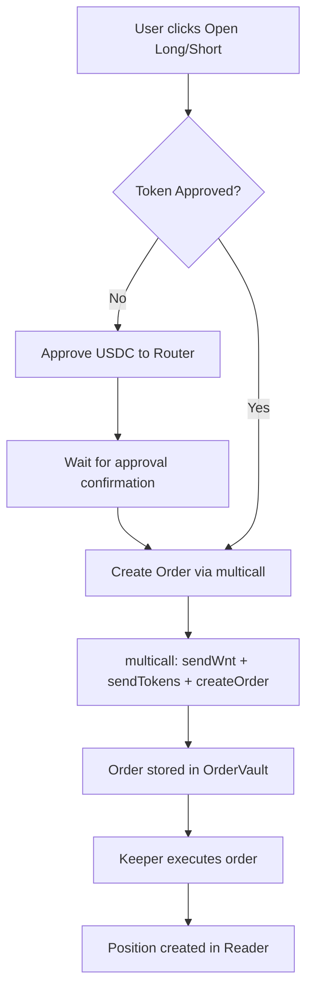
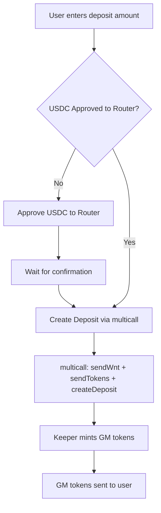

# GMX V2 Trading Console - System Architecture & Reference

> Comprehensive documentation of actions, flows, constraints, and common errors.

---

## Table of Contents
- [Contract Addresses](#contract-addresses)
- [Order Flow](#order-flow)
- [Liquidity Flow](#liquidity-flow)
- [Token Approval Requirements](#token-approval-requirements)
- [Validation Rules](#validation-rules)
- [Common Errors & Solutions](#common-errors--solutions)
- [Price & Decimals Reference](#price--decimals-reference)

---

## Contract Addresses

| Contract | Address | Purpose |
|----------|---------|---------|
| **ExchangeRouter** | `0xD5c0a7DFe2e4a5D1BE5927d0816393d145a3f0d5` | Entry point for multicall transactions |
| **Router** | `0x25bdBd9c21497D276000D4ebB9203DbE2eD408f7` | **SPENDER for token approvals** |
| **DataStore** | `0xF2ea404864b2E9cd5DCA985079Bee6e9BC3AedE2` | Protocol configuration storage |
| **Reader** | `0x81ec3c87553EDaBd7b391AED31ee6EDd51Ec54b7` | Read positions, markets, prices |
| **OrderVault** | `0xe5474698f1A1c0381BB21476BdA1A4968d017D3a` | Receives tokens for orders |
| **DepositVault** | `0x228FB4eAfACbA605Fc7b160BEd7A4fd1a21E804B` | Receives tokens for deposits |
| **WithdrawalVault** | `0x8E01E9a99A730bdEd580160D55d9B266127B298A` | Receives GM tokens for withdrawals |
| **USDC** | `0xE0105CF6930e8767ADb5425ddc7f8B6df25699A6` | Collateral token (6 decimals) |
| **WNT** | `0xd020d6D39b5550bdc3440Ff8f6EA5f1Cf745b13c` | Native wrapped token (18 decimals) |
| **EventEmitter** | `0x2F590A4c9042C02472FfA0491Fc5D16732e9d33A` | Emits protocol events |

---

## Order Flow

### 1. Open Position (Increase Order)



**Multicall Steps:**
1. `sendWnt(OrderVault, executionFee)` - Send execution fee
2. `sendTokens(USDC, OrderVault, collateralAmount)` - Send collateral
3. `createOrder(params)` - Create the order

**Order Parameters:**
```typescript
{
  addresses: {
    receiver: userAddress,
    callbackContract: "0x0...",
    uiFeeReceiver: "0x0...",
    market: marketToken,
    initialCollateralToken: USDC,
    swapPath: []
  },
  numbers: {
    sizeDeltaUsd: sizeInUsd * 10^30,
    initialCollateralDeltaAmount: collateral * 10^6,
    triggerPrice: 0n,
    acceptablePrice: isLong ? maxUint256 : 0n,
    executionFee: 0.015 ETH,
    callbackGasLimit: 0n,
    minOutputAmount: 0n
  },
  orderType: 2, // MarketIncrease
  decreasePositionSwapType: 0,
  isLong: true/false,
  shouldUnwrapNativeToken: false,
  referralCode: bytes32(0)
}
```

### 2. Close Position (Decrease Order)

**Key Difference:** No collateral sent, only execution fee.

```typescript
orderType: 4  // MarketDecrease
sizeDeltaUsd: position.size * 10^30  // Full close
```

---

## Liquidity Flow

### 1. Deposit Liquidity (Add GM Tokens)



**Deposit Parameters:**
```typescript
{
  addresses: {
    receiver: userAddress,
    callbackContract: "0x0...",
    uiFeeReceiver: "0x0...",
    market: marketToken,
    initialLongToken: WNT,
    initialShortToken: USDC,
    longTokenSwapPath: [],
    shortTokenSwapPath: []
  },
  minMarketTokens: 0n,
  shouldUnwrapNativeToken: false,
  executionFee: 0.015 ETH,
  callbackGasLimit: 200000n,
  dataList: []
}
```

### 2. Withdraw Liquidity (Burn GM Tokens)

> [!IMPORTANT]
> GM tokens must be approved to **Router** before withdrawal.

**Flow:** Approve GM → Send GM to WithdrawalVault → Create Withdrawal → Keeper burns GM → USDC returned.

---

## Token Approval Requirements

> [!CAUTION]
> **Always approve to `Router` contract, NOT `ExchangeRouter`!**
> The Router is the actual contract that executes `transferFrom`.

| Action | Token to Approve | Spender |
|--------|------------------|---------|
| Open Order | USDC | `0x25bd...` (Router) |
| Deposit Liquidity | USDC | `0x25bd...` (Router) |
| Withdraw Liquidity | GM Token | `0x25bd...` (Router) |
| Close Order | None | (Only execution fee) |

**Approval Code:**
```typescript
const spender = CONTRACTS.router; // NOT exchangeRouter!
await writeContractAsync({
  address: tokenAddress,
  abi: erc20Abi,
  functionName: 'approve',
  args: [spender, maxUint256]
});
```

---

## Validation Rules

### 1. Minimum Collateral ($10+ USD)

**DataStore Key:** `keccak256(encodeAbiParameters([{type: 'string'}], ['MIN_COLLATERAL_USD']))`

> [!WARNING]
> Orders with collateral below minimum will be **CANCELLED** by keeper with reason `"min collateral"`.

**Recommended:** Use `MIN_COLLATERAL_USD + $1 buffer` = **$11** minimum.

### 2. Leverage Limits

| Parameter | Value |
|-----------|-------|
| Min Leverage | 1.1x |
| Max Leverage | 50x |

### 3. Execution Fee

| Action | Min Fee |
|--------|---------|
| Create Order | 0.015 ETH |
| Create Deposit | 0.015 ETH |
| Create Withdrawal | 0.015 ETH |

> User must have sufficient native token (HNC/ETH) for execution fees.

---

## Common Errors & Solutions

### 1. Order Cancelled - `MinCollateral`

**Symptom:** Order created successfully but cancelled during execution.

**Cause:** Collateral amount after fees < $10 USD.

**Solution:**
- Increase collateral to $11+ USD
- Check `MIN_COLLATERAL_USD` from DataStore

---

### 2. Transaction Reverted - `ERC20: insufficient allowance`

**Symptom:** multicall transaction reverts.

**Cause:** Token not approved, or approved to wrong contract.

**Solution:**
- Approve to `Router` (`0x25bdBd9c21497D276000D4ebB9203DbE2eD408f7`)
- NOT `ExchangeRouter`

---

### 3. Duplicate Positions Displayed

**Symptom:** Same position appears twice in UI.

**Cause:** Optimistic local positions merged with real data.

**Solution:** Remove `localPositions` merging, use only `realPositions` from Reader.

---

### 4. Balance Not Updating After Transaction

**Symptom:** Balance shows old value after order/deposit.

**Cause:** No `refetchInterval` on balance hooks.

**Solution:**
```typescript
query: {
  refetchInterval: 5000 // 5 seconds
}
```

---

### 5. Price Mismatch (Wrong Decimals)

**Symptom:** Price shows very large/small numbers.

**Cause:** Wrong decimal conversion.

**Reference:**
| Value Type | Decimals |
|------------|----------|
| USD values (sizeDeltaUsd, pnl) | 30 |
| USDC amounts | 6 |
| WNT/ETH amounts | 18 |
| Prices in GMX | 30 (use `formatGmxPrice`) |
| Execution price (subgraph) | 12 |

---

### 6. Wrong Position Type Display (Long shown as Short)

**Symptom:** "Close Short" displayed for Long position.

**Cause:** `isLong` field not correctly propagated.

**Solution:** Always check `trade.isLong` boolean, not orderType alone.

---

## Price & Decimals Reference

### GMX V2 Price Format

```typescript
// Raw price from contract (30 decimals)
const rawPrice = "5000000000000000000000000000000000"; // $5000

// Convert to human readable
const price = Number(formatUnits(BigInt(rawPrice), 30)); // 5000.0
```

### Token Decimals Lookup

```typescript
const getTokenDecimals = (address: string) => {
  if (address === CONTRACTS.usdc) return 6;
  if (address === CONTRACTS.wnt) return 18;
  return 18; // Default
};
```

### DataStore Key Generation

```typescript
// Simple keys
const key = keccak256(
  encodeAbiParameters([{ type: 'string' }], ['MIN_COLLATERAL_USD'])
);

// Market-specific keys
const marketKey = keccak256(
  encodeAbiParameters(
    [{ type: 'bytes32' }, { type: 'address' }],
    [baseKey, marketAddress]
  )
);
```

---

## Architecture Diagram

```
┌─────────────────────────────────────────────────────────────┐
│                       FRONTEND (React)                      │
├─────────────────────────────────────────────────────────────┤
│  TradeConsole    │  LiquidityConsole  │  Portfolio          │
│  ├─ OrderPanel   │  ├─ VaultDrawer    │  ├─ Positions       │
│  └─ PositionsPanel│  └─ VaultCards    │  └─ Balance         │
└─────────────────────────────────────────────────────────────┘
                              │
                              ▼
┌─────────────────────────────────────────────────────────────┐
│                         HOOKS                                │
├─────────────────────────────────────────────────────────────┤
│  useCreateOrder     │  usePositions      │  useTokenBalance  │
│  useClosePosition   │  useTradeHistory   │  useMinCollateral │
│  useCreateDeposit   │  useLiquidity      │  useOrderValidation│
│  useCreateWithdrawal│  useMarkets        │  useTokenApproval │
└─────────────────────────────────────────────────────────────┘
                              │
                              ▼
┌─────────────────────────────────────────────────────────────┐
│                     GMX V2 CONTRACTS                         │
├─────────────────────────────────────────────────────────────┤
│  ExchangeRouter → Router → OrderVault/DepositVault          │
│                                    │                         │
│                              KEEPER SERVICE                  │
│                                    ▼                         │
│  DataStore ← Reader ← Positions/Markets                     │
└─────────────────────────────────────────────────────────────┘
```

---

## Quick Checklist for New Features

- [ ] Token approval to **Router** (not ExchangeRouter)
- [ ] Execution fee included in transaction value
- [ ] Correct decimals (6 for USDC, 18 for WNT, 30 for USD)
- [ ] Min collateral validation ($11+)
- [ ] Error toast on transaction failure
- [ ] Loading states on buttons
- [ ] Balance refetch after transactions
- [ ] Clear inputs after successful action

---

*Last updated: 2026-01-07*
